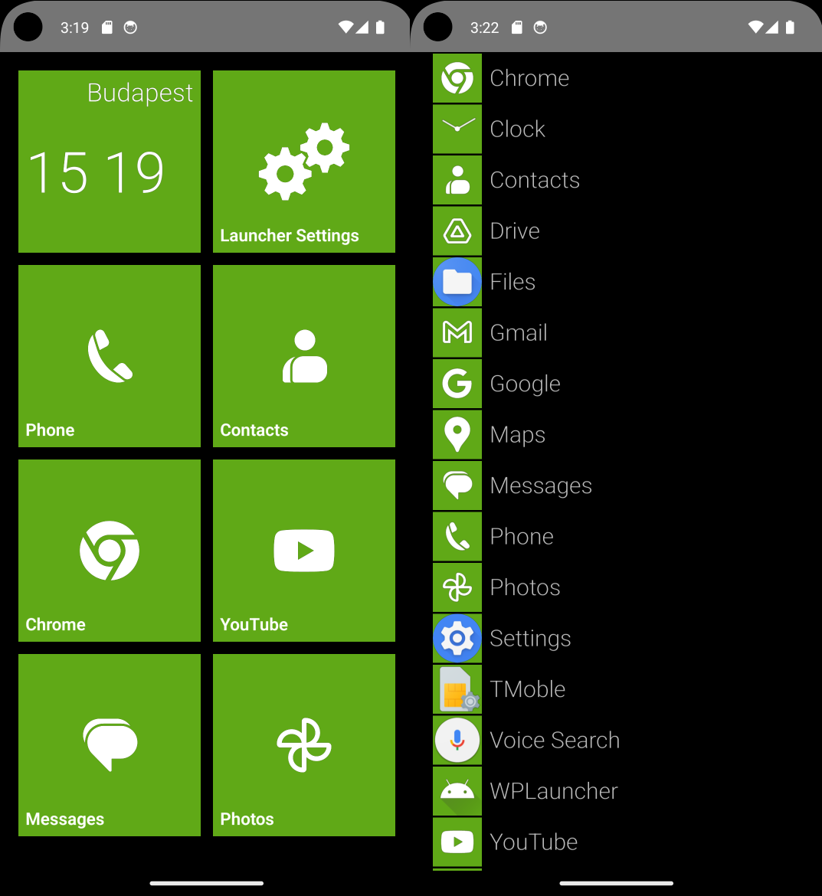
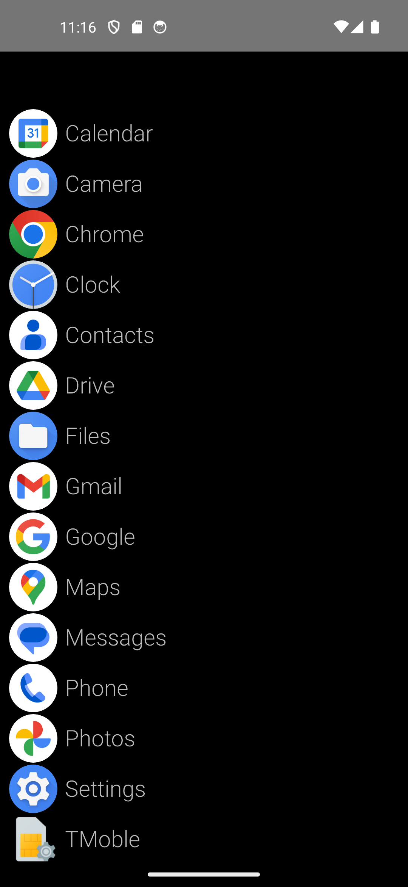

# WPLauncher ES

A reimplementation of my old WPLauncher project using OpenGL ES. 
The goal remains the same: a WP7/8 style launcher, now with no external UI frameworks.

## Planned features

- WP7/8 style live tiles
- App list
- Pin apps to the screen
- Installed apps and custom "widgets"
- Resizable tiles
- 4/6 column mode

## Tech stack
- Java 
- OpenGL ES2.0
- API Level 34

## Milestones

### M1

M1 is all about laying the groundwork. Don't expect anything fancy here. At this phase the application is barely usable.

- [x] 4 columns
- [x] Show *something* on the tiles
- [x] Show app icon on tiles
- [x] Listview for the installed apps
- [x] Icon on list elements
- [x] Swipe between start page and application list page
- [x] Handle tap event on tiles
- [x] Long press on tiles
- [x] Long press on list items
- [x] Context menu
- [x] Pin installed apps to the screen
- [x] Unpin installed apps from the main screen
- [x] Launch app from the app list
- [x] Launch pinned apps
- [x] Uninstall app
- [x] Data structure to store tiles on the main screen
- [x] Rearrange tiles on the grid
- [x] Persist tile arrangement

### M1.5

Consolidation

- [x] Extracting draw contexts
- [x] Applist state machine (also fixed fling to keep momentum)
- [x] Tilegrid state machine
- [x] Fix de-select bug when rearranging tiles

### M2

M2 is the beginning to make the launcher usable in everyday use-cases.

- [ ] Start working on "launcher apps/widgets/live tiles"
    - [ ] Clock
    - [ ] Weather
    - [ ] Me/Timeline
    - [ ] Launcher settings
    - [ ] Calendar
    - [ ] Mail
    - [ ] Messages
    - [ ] Photos
    - [ ] Contacts
- [ ] Change accent color
- [ ] Global settings service with fixed options
- [ ] Persist settings
- [ ] Resize tiles / Multi size app tiles
- [ ] Feedback to the user when clicked (Rotation/animations/etc)
- [ ] Generic carousel view
- [ ] Stack view
- [ ] UI elements
  - [ ] Button
  - [ ] Dropdown
  - [ ] Switch / checkbox

### M3

M3 is the preparation for a first public beta release.

- [ ] Further development TBD
- [ ] More tiles
- [ ] Optimizations
- [ ] Bug fixes
- [ ] Multi lang support
- [ ] Light mode/Dark mode support
- [ ] First public beta version (?)

### M4

- [ ] Landscape mode support
- [ ] Background image with transparent tiles
- [ ] 6 column mode setting
- [ ] WP7/7.8 start screen setting

### Current progress

M1 is in progress

## Planned live custom tiles / "widgets"

Widgets with live data

- Me (Timeline / notifications / tasks / slideshows / weather info / travel info / clock / twitter / fb / etc.)
- Photos slideshow
- Messages
- Weather
- Clock / Time
- News feed
- Tasks
- Calendar
- Email
- Hungarian name days

*Information gathering via public API-s. When public API-s are not available extract information from system notifications if its possible*