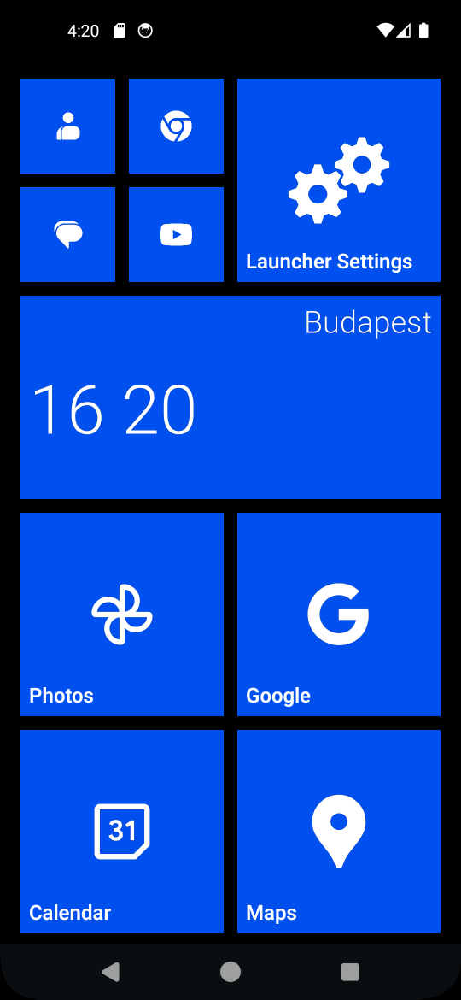
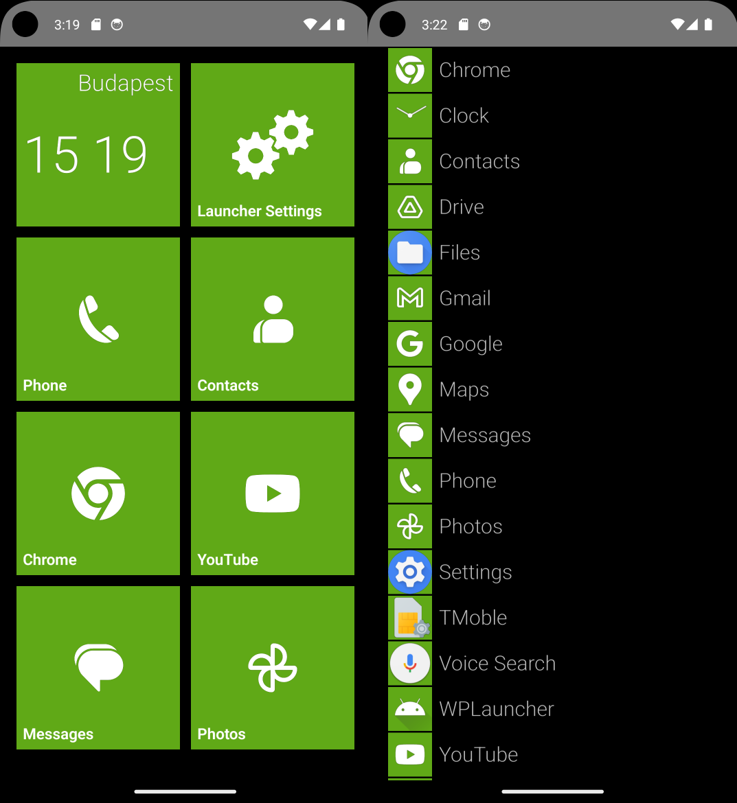

# WPLauncher ES

A reimplementation of my original WPLauncher project using OpenGL ES. 
The goal remains the same: a WP7/8 style launcher, now with no external UI frameworks.

## Planned features

- WP7/8 style live tiles
- App list
- Pin apps to the screen
- Installed apps and custom "widgets"
- Resizable tiles
- 4/6 column mode

## Tech stack
- Java 
- OpenGL ES3.2
- API Level 34

## Milestones

This is a living roadmap, all future milestones are refined as I go, and subject to change.

### M1 - POC / pre-alpha

M1 is all about laying the groundwork. Don't expect anything fancy here. At this phase the application is barely usable.

- [x] 4 columns
- [x] Show *something* on the tiles
- [x] Show app icon on tiles
- [x] Listview for the installed apps
- [x] Icon on list elements
- [x] Swipe between start page and application list page
- [x] Handle tap event on tiles
- [x] Long press on tiles
- [x] Long press on list items
- [x] Context menu
- [x] Pin installed apps to the screen
- [x] Unpin installed apps from the main screen
- [x] Launch app from the app list
- [x] Launch pinned apps
- [x] Uninstall app
- [x] Data structure to store tiles on the main screen
- [x] Rearrange tiles on the grid
- [x] Persist tile arrangement

### M1.5

Consolidation

- [x] Extract draw contexts
- [x] App-list state machine (also fixed fling to keep momentum)
- [x] Tile-grid state machine
- [x] Fix de-select bug when rearranging tiles

### M2 - MVP / alpha

M2 is the beginning of making the launcher usable in everyday use-cases.

- [x] Start working on "launcher apps/widgets/live tiles"
    - [x] Clock
    - [x] Launcher settings
    - [x] Show notification count on tiles
    - [x] Show notification content on corresponding tiles
- [x] Change accent color
- [x] Settings service
- [x] Persist settings
- [x] Resize tiles
- [x] Generic list view
- [x] Stack view
- [x] Basic flex layout
    - [x] Support row and column layout modes
    - [x] Support alignment
    - [x] Flex layout as a child of flex layout
- [x] Absolute layout
  - [x] Use Absolute layout for static tiles
- [x] Use an Icon UI element instead of basic textures for icons to be able to use them in layouts 
- [x] Basic UI elements
  - [x] Button
  - [x] Checkbox

### M2.5

I'm already daily-driving, you shouldn't be.
    
- [x] Checkbox border
- [x] Fix: pin the same tile multiple times
- [x] Don't show uninstall in the context menu for internal and system apps
- [x] Fix: tile overlap after resize
- [x] Remove uninstalled app from the applist/tilegrid
- [x] Fix: Updated app is removed from the grid and app-list instead of updating
- [x] Adjust notification count on tiles - don't allow overlap with the icon
- [x] Fix: Scrolling while swiping on the main screen (scrolling on tile-grid keeps working, WHILE in SWIPING state) -- keeping an eye out, this was a sneaky one
- [x] Fix: Some notifications are counted multiple times
- [x] Use AbsoluteLayout in the ClockHUB tile
- [x] Press "Home" button to jump back to the top of the tile-grid  

### M3 - beta

Try to make it usable for the less crazy people

- [x] GLES 3.2
- [x] Make ContextMenu and MenuOption to use layouts and labels
- [x] Make ListItem use high level UI components
- [ ] More tiles & specific tiles for common apps
  - [ ] Tasks
  - [ ] Photos
  - [ ] Weather
  - [ ] Messenger
  - [ ] Messages
  - [ ] Contacts
- [ ] Feedback to the user when clicked (Rotation/animations/etc)
- [ ] Generic carousel view
- [ ] Gesture system refactor
- [ ] Reconsider tile reflow logic (tile occupancy bool map, for every tile top to bottom -> remove -> find the highest available pos where it fits -> place?)
- [ ] Optimizations
- [ ] Bug fixes
- [ ] Multi lang support
- [ ] Light mode/Dark mode support
  - [ ] Dropdown 
- [ ] Radiobutton
- [ ] Disable landscape mode
- [ ] Re-ask for permissions from the launcher settings
- [ ] Search bar in the app-list
- [ ] Scissor test on tiles to prevent drawing out of the tile

### M3.5

Try it at your own risk

- [ ] Maybe a closed beta (?)
- [ ] TBD

### M4 - RC

- [ ] Landscape mode support
- [ ] Background image with transparent tiles
- [ ] 6 column mode setting
- [ ] WP7/7.8 start screen setting
- [ ] Custom tile color

### Bugs that need repro:

- [ ] Fix: black bar in the place of the notification count when all previous notifications were dismissed (on real hardware, needs repro)
- [ ] Fix: sometimes tiles don't spin when there is a notification (detected on real hardware, needs repro)
- [ ] Fix: Tile bg after resize is dark (needs repro)

### Current progress

M3 is in progress

## Planned live custom tiles / "widgets"

Widgets with live data

- Me (Timeline / notifications / tasks / slideshows / weather info / travel info / clock / twitter / fb / etc.)
- Photos slideshow
- Messages
- Weather
- Clock / Time
- News feed
- Tasks
- Calendar
- Email
- Hungarian name days

*Information gathering via public API-s. When public API-s are not available extract information from system notifications if its possible*
